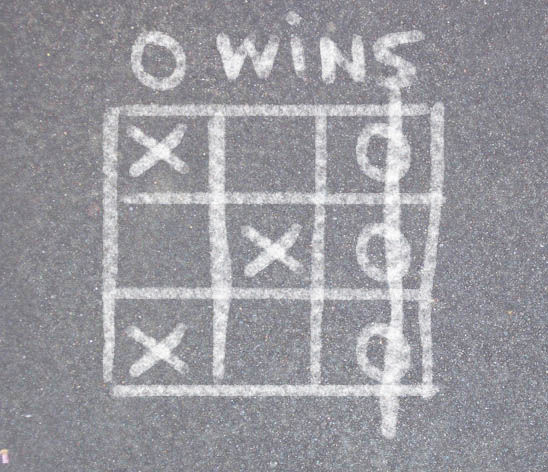

Tic-Tac-Toe game written in Java with TDD (Test-Driven Development)
===================================================================

[Play](http://newagebegins.github.com/TicTacToe/TicTacToe.html)

The game is written in Java, so to play it you need to have [Java Runtime Environment](http://java.com/) installed. Also in order to play in a browser, you have to add the site with the game into the "Exception List" in "Java Control Panel > Security". Read http://java.com/en/download/help/jcp_security.xml for details.

